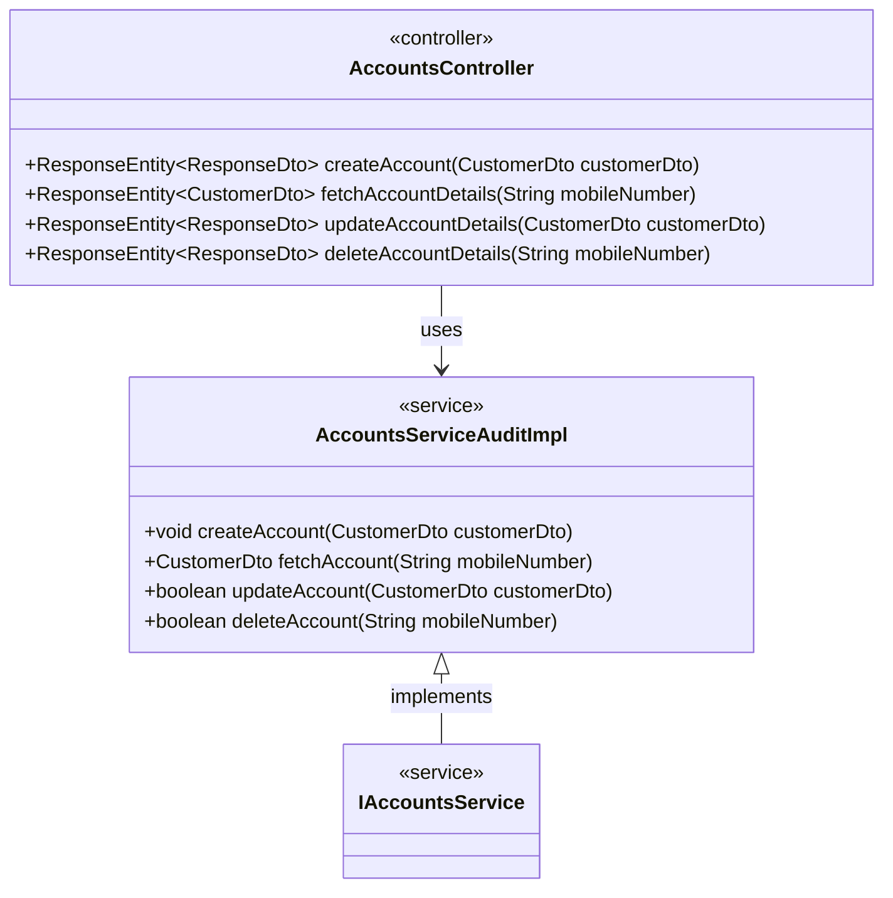
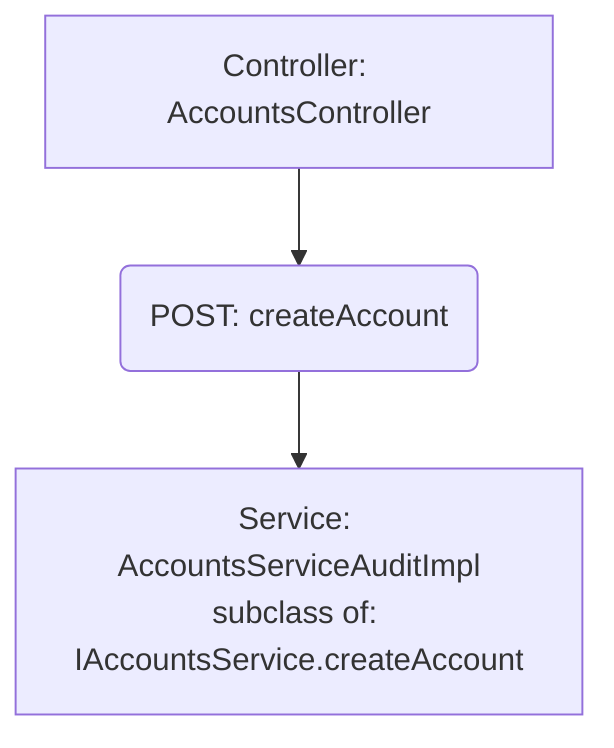

# RepoAtlas Demo: EazyBank Microservices

This demo showcases what RepoAtlas extracts from a real Spring Boot microservices codebase — without compiling, running, or instrumenting anything. Just point it at Java source files and get structured analysis.

## Quick Start

```bash
# Full analysis → Markdown report
uv run --frozen --exclude-newer 2026-03-11 python app/src/app/java_analyze.py \
  demo/section_20/ --recursive --format markdown \
  -o demo/section_20/output/analysis.md

# Full analysis → JSON (for programmatic consumption)
uv run --frozen --exclude-newer 2026-03-11 python app/src/app/java_analyze.py \
  demo/section_20/ --recursive --format json \
  -o demo/section_20/output/analysis.json

# Mermaid class diagram
uv run --frozen --exclude-newer 2026-03-11 python app/src/app/java_analyze.py \
  demo/section_20/ --recursive --format mermaid-class \
  -o demo/section_20/output/class-diagram.mmd

# Mermaid flow diagram (controller → service call chains)
uv run --frozen --exclude-newer 2026-03-11 python app/src/app/java_analyze.py \
  demo/section_20/ --recursive --format mermaid-flow \
  -o demo/section_20/output/flow-diagram.mmd

# Plain text summary
uv run --frozen --exclude-newer 2026-03-11 python app/src/app/java_analyze.py \
  demo/section_20/ --recursive --format text \
  -o demo/section_20/output/analysis.txt
```

## Search Commands

```bash
# Find a specific controller by name
uv run --frozen --exclude-newer 2026-03-11 python app/src/app/java_analyze.py \
  demo/section_20/ --recursive --format markdown \
  --search AccountsController --search-type name

# Find all classes in a package
uv run --frozen --exclude-newer 2026-03-11 python app/src/app/java_analyze.py \
  demo/section_20/ --recursive --format text \
  --search com.eazybytes.cards --search-type package

# Find a class by its source file path
uv run --frozen --exclude-newer 2026-03-11 python app/src/app/java_analyze.py \
  demo/section_20/ --recursive --format markdown \
  --search LoansController.java --search-type path
```

---

## What the Analyzer Sees vs. Raw Source

### 1. Autowire Resolution: Who Actually Handles the Request?

**The problem:** Spring controllers depend on interfaces, not implementations. Reading the source, you see `IAccountsService` — but which concrete class runs at runtime?

**Raw source** (`AccountsController.java`):
```java
@Autowired
@Qualifier("audit")
private IAccountsService iAccountsService;
```

There are two implementations of `IAccountsService`:
- `AccountsServiceImpl` — marked `@Primary` (the default)
- `AccountsServiceAuditImpl` — annotated with `@Service("audit")`

Spring's rule is that an explicit `@Qualifier` takes precedence over `@Primary`. RepoAtlas matches this behavior — it resolves the injection to the qualifier target, not the primary:

**What RepoAtlas resolves:**

```
Service Dependencies:
  IAccountsService iAccountsService (qualifier: audit)

Method createAccount calls:
  (IAccountsService -> AccountsServiceAuditImpl)iAccountsService.createAccount()
```

The analyzer traces the `@Qualifier("audit")` to find `AccountsServiceAuditImpl`, not just the interface. You immediately know which class handles every call.

### 2. @Primary Disambiguation

**Raw source** (`CardsController.java`):
```java
public CardsController(ICardsService iCardsService) {
    this.iCardsService = iCardsService;
}
```

Two implementations exist: `CardsServiceImpl` (marked `@Primary`) and `CardsServiceCacheImpl`. No qualifier needed — Spring picks `@Primary`.

**What RepoAtlas resolves:**

| Type | Superclass | Name | Qualifier |
|------|------------|------|-----------|
| `CardsServiceImpl` | `ICardsService` | `iCardsService` | |

The analyzer correctly identifies `CardsServiceImpl` as the injected implementation via `@Primary`, even through constructor injection.

### 3. Single-Implementation Autowiring

**Raw source** (`LoansController.java`):
```java
public LoansController(ILoansService iLoansService) {
    this.iLoansService = iLoansService;
}
```

Only one implementation (`LoansServiceImpl`) exists — unambiguous.

**What RepoAtlas resolves:**

| Type | Superclass | Name | Qualifier |
|------|------------|------|-----------|
| `LoansServiceImpl` | `ILoansService` | `iLoansService` | |

### 4. Constant Chaining in Endpoint Paths

**The problem:** Spring annotations often reference constants, which may chain across classes and modules. Grep can't follow these chains.

**Raw source chain:**
```java
// common module: ApiConstants.java
public static final String BASE_PATH = "/api";

// accounts module: AccountsConstants.java
public static final String ACCOUNTS_BASE = ApiConstants.BASE_PATH;
public static final String CREATE_URL = "/create";

// AccountsController.java
@RequestMapping(path = AccountsConstants.ACCOUNTS_BASE, ...)
@PostMapping(AccountsConstants.CREATE_URL)
```

**What RepoAtlas resolves** (endpoint-level constants → literal paths):

| HTTP Method | Path | Method |
|------------|------|--------|
| POST | `AccountsConstants.ACCOUNTS_BASE/create` | `createAccount` |
| GET | `AccountsConstants.ACCOUNTS_BASE/fetch` | `fetchAccountDetails` |
| PUT | `AccountsConstants.ACCOUNTS_BASE/update` | `updateAccountDetails` |
| DELETE | `AccountsConstants.ACCOUNTS_BASE/delete` | `deleteAccountDetails` |

The method-level constants (`CREATE_URL`, `FETCH_URL`, etc.) are resolved to their literal values (`/create`, `/fetch`), while the base path preserves the constant reference for traceability.

### 5. Property Resolution (@Value Placeholders)

**Raw source:**
```java
// AccountsController.java
@Value("${build.version}")
private String buildVersion;

@Value("${eazybank.accounts.base-url}")
private String accountsBaseUrl;

// LoansController.java — default fallback
@Value("${loans.max-amount:500000}")
private String maxLoanAmount;
```

**What RepoAtlas resolves** (with property files loaded):

```python
from app.src.codeanalyzer.analyzer import JavaAnalyzer

analyzer = JavaAnalyzer()
analyzer.parse_directory("demo/section_20/", recursive=True)
for svc in ["accounts", "cards", "loans"]:
    analyzer.property_resolver.load_properties_file(
        f"demo/section_20/{svc}/src/main/resources/application.properties"
    )
analyzer._resolve_all_references()

# ${build.version}              → "1.0.0"
# ${eazybank.accounts.base-url} → "http://localhost:8080"
# ${loans.max-amount:500000}    → "500000"  (key absent, default used)
```

### 6. Cross-Service Architecture at a Glance

**67 source files → one summary:**

```
Total classes: 67
  controller: 7, service: 10, repository: 4, dto: 14,
  entity: 7, mapper: 4, api_client: 2, exception: 6, other: 13

API Client Classes:
  - CardsFeignClient
  - LoansFeignClient
```

**Mermaid class diagram** (generated from `--format mermaid-class`):



**Flow diagram** (generated from `--format mermaid-flow`):



### 7. JSON Output for Tooling

The `--format json` output is designed for programmatic consumption — pipe it into your own tools, dashboards, or LLM prompts:

```json
{
  "controllers": [
    {
      "name": "AccountsController",
      "base_endpoint_path": "AccountsConstants.ACCOUNTS_BASE",
      "endpoints": {
        "POST": [{ "path": "AccountsConstants.ACCOUNTS_BASE/create", "method": "createAccount" }],
        "GET":  [{ "path": "AccountsConstants.ACCOUNTS_BASE/fetch",  "method": "fetchAccountDetails" }]
      },
      "service_dependencies": [
        {
          "name": "iAccountsService",
          "type": "IAccountsService",
          "is_autowired": true,
          "qualifier": "audit"
        }
      ]
    }
  ]
}
```

---

## Resolver Coverage in This Demo

| Resolver | What It Does | Where to See It |
|----------|-------------|-----------------|
| **ImportResolver** | Classifies imports (JDK / third-party / project) | All files — natural from the codebase |
| **TypeResolver** | Resolves field types to their declarations | Controller → service interface → entity chains |
| **ConstantResolver** | Follows constant chains across classes | `AccountsConstants.ACCOUNTS_BASE → ApiConstants.BASE_PATH → "/api"` |
| **PathResolver** | Resolves constants used in endpoint annotations | `@PostMapping(AccountsConstants.CREATE_URL)` → `/create` |
| **AutowireResolver** | Matches interfaces to concrete implementations | `@Qualifier("audit")`, `@Primary`, single-impl |
| **PropertyResolver** | Resolves `@Value("${...}")` from `.properties` files | `${build.version}` → `"1.0.0"`, `${loans.max-amount:500000}` → default |

## Pre-Generated Output

The `output/` directory contains pre-generated analysis results:

| File | Format | Description |
|------|--------|-------------|
| `output/analysis.md` | Markdown | Full analysis report with tables |
| `output/analysis.json` | JSON | Machine-readable analysis |
| `output/analysis.txt` | Text | Plain text summary |
| `output/class-diagram.mmd` | Mermaid | Class relationship diagram |
| `output/flow-diagram.mmd` | Mermaid | Controller → service call flow |
